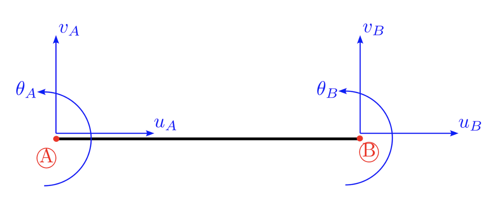
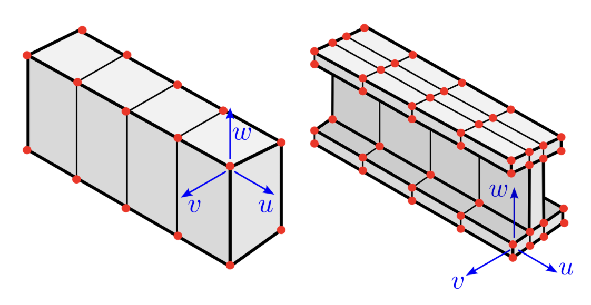
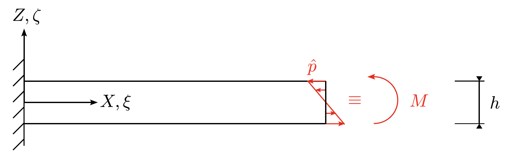
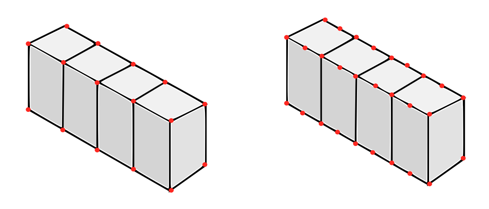
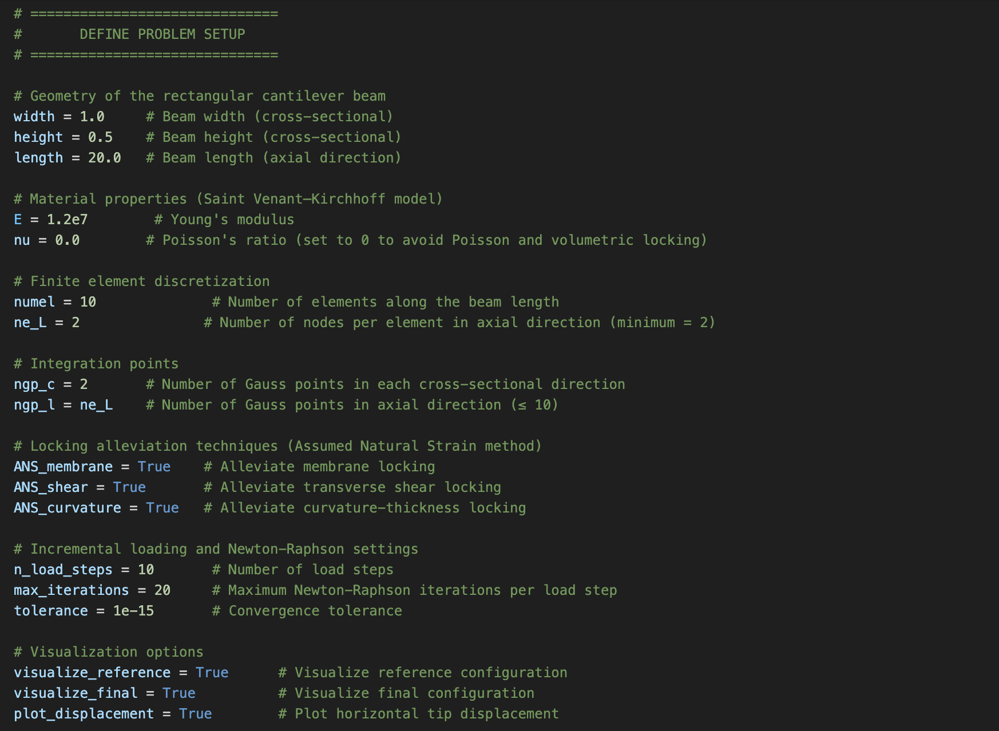
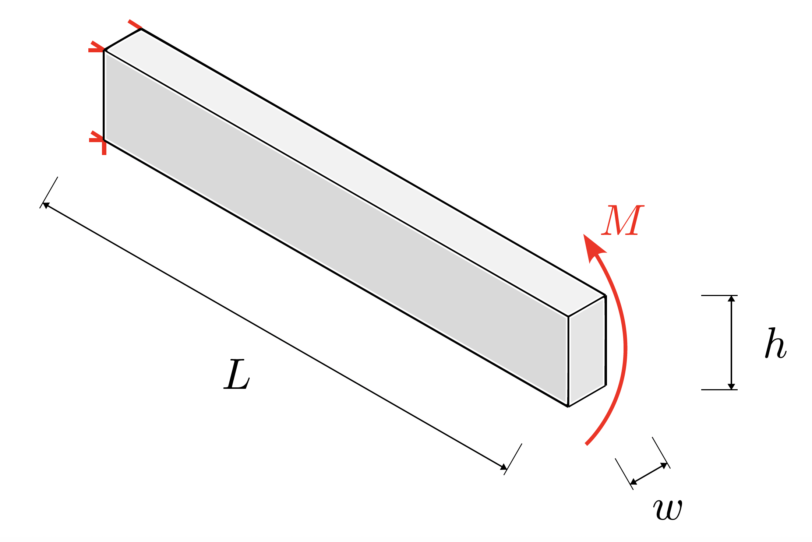
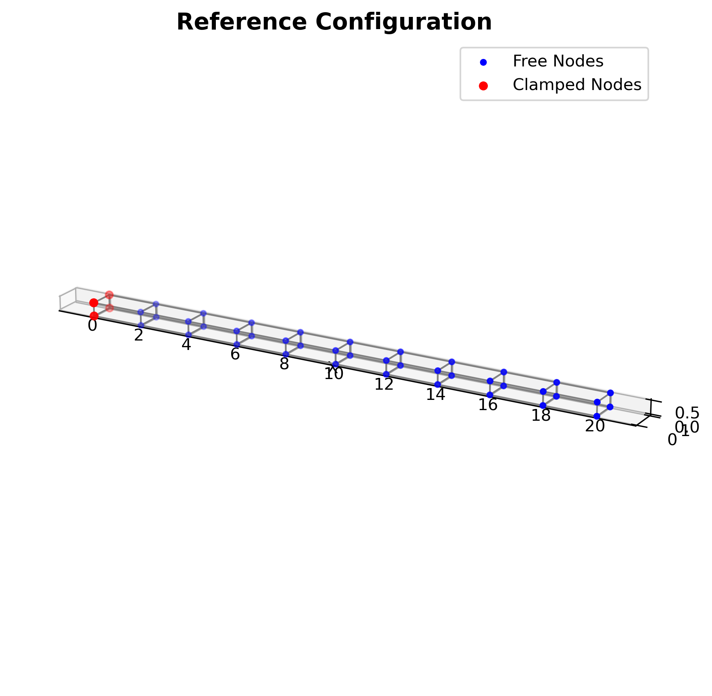
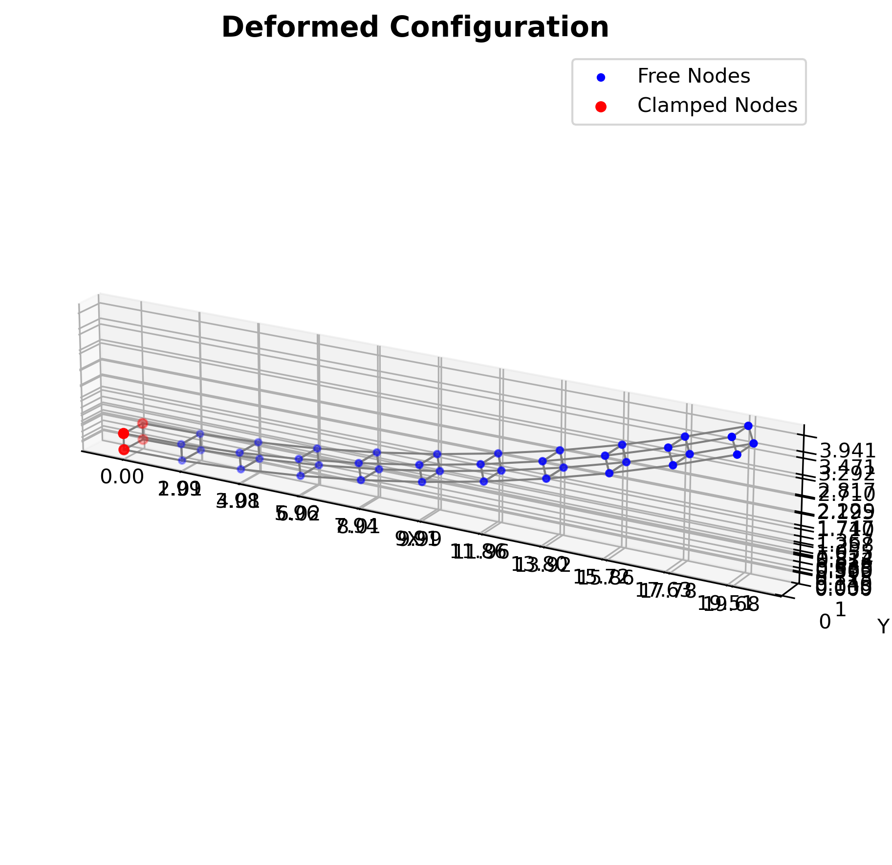
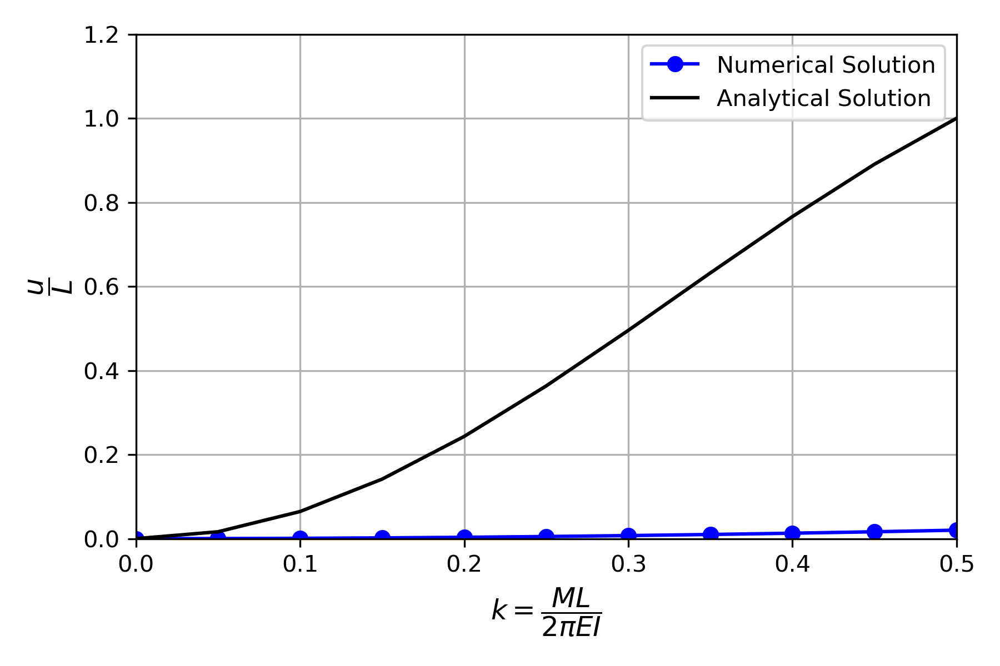

# Improved Brick Finite Elements for Beam Problems

> **Note**  
> If figures do not appear, please refresh the page.

## Table of Contents

- [Introduction](#introduction)
- [Conda Environment, Installation, and Testing](#conda-environment-installation-and-testing)
- [The Boundary Value Problem](#the-boundary-value-problem)
- [Nonlinear Finite Element Procedure](#nonlinear-finite-element-procedure)
- [Locking Modes](#locking-modes)
- [Assumed Natural Strain Method](#assumed-natural-strain-method)
- [Code Usage Instructions](#code-usage-instructions)
- [Numerical Example 1](#numerical-example-1)
- [Future Work](#future-work)

## Motivation

It is common to model slender beams using classical **beam finite elements**, which are efficient and widely used in engineering applications.

  

However, **1D beam theories** come with important limitations: they struggle to capture **advanced material behaviors**, cannot represent **cross-sectional deformations**, and pose challenges for **multiphysics coupling** and **contact interactions**. These limitations stem from the **inherent assumptions of 1D beam theory** and are **not artifacts of the finite element method**.

To overcome these limitations, this project adopts a **solid-beam modeling approach** using **3D brick finite elements**. These formulations offer greater flexibility and accuracy in capturing the full 3D deformation of beam-like structures.

  

However, **low-order brick elements** often suffer from **locking**, leading to inaccurate results. This project develops **brick finite element beams**, combining **Lagrange shape functions** with the **Assumed Natural Strain (ANS)** method to alleviate locking. We apply the code to a **benchmark problem** and investigate the **effects of different locking modes**. We also compare **ANS** to other approaches like **h-refinement**, **p-refinement**, and **reduced integration**.

Below are two videos comparing the analytical and finite element solutions for a cantilever beam subjected to a tip moment.

The **first video** shows the **analytical solution**, where the beam forms a full circle under a tip moment of $M = 2π·EI / L$.

The **second video** presents the **finite element simulation** using a coarse 3D mesh with four fully integrated trilinear elements. Due to **locking**, the beam fails to deform into a full circle and appears overly stiff.

Click on each thumbnail below to watch the video on **YouTube**:

## Conda Environment, Install, and Testing

## The Boundary Value Problem

In order to construct a complete BVP, we need to bring together kinematics, balance relations and material law, in addition to the boundary conditions. We formulate the problem using **convective coordinates** for better structural mechanical interpretation and later implementation flexibility.

### 1. Kinematics

We distinguish between the **reference configuration** $\mathcal{B}_0$ with material coordinates $\mathbf{X}$, and the **current configuration** $\mathcal{B}$ with spatial coordinates $\mathbf{x}$. The displacement is given by $\mathbf{u} = \mathbf{x} - \mathbf{X}$.

- The **deformation gradient** is computed via the chain rule:  
  $\mathbf{F} = \dfrac{\partial \mathbf{x}}{\partial \mathbf{X}} = \dfrac{\partial \mathbf{x}}{\partial \xi^i} \otimes \dfrac{\partial \xi^i}{\partial \mathbf{X}} = \mathbf{g}_i \otimes \mathbf{G}^i$  
  where:  
  - $\xi^i \in \{\xi, \eta, \zeta\}$ are **convective (natural) coordinates**  
  - $\mathbf{g}_i$ are **covariant base vectors** in the current configuration  
  - $\mathbf{G}^i$ are **contravariant base vectors** in the reference configuration

- The **Green-Lagrange strain tensor** is given by  
  $\mathbf{E} = \dfrac{1}{2}(\mathbf{C} - \mathbf{I})$, with $\mathbf{C} = \mathbf{F}^\top \mathbf{F}$.

- In the **contravariant basis** $\{\mathbf{G}^i\}$, the strain tensor is written as  
  $\mathbf{E} = E^{ij} \, \mathbf{G}_i \otimes \mathbf{G}_j$, with $E^{ij} = \dfrac{1}{2}(g^{ij} - G^{ij})$.

> Metric tensors $g^{ij} = \mathbf{g}_i \cdot \mathbf{g}_j$ and $G^{ij} = \mathbf{G}_i \cdot \mathbf{G}_j$ allow transformation between covariant and contravariant components.

- In **Voigt notation**, we exploit the symmetry of the strain tensor to write it as  
$\hat{\mathbf{E}} = \left[ \overline{E}{\xi \xi},\ \overline{E}{\eta \eta},\ \overline{E}{\zeta \zeta},\ 2\overline{E}{\xi \eta},\ 2\overline{E}{\eta \zeta},\ 2\overline{E}{\xi \zeta} \right]^\mathrm{T}$.

### 2. Balance Relations

- The **strong form** of the equilibrium equations is:  
  $\text{Div}(\mathbf{P}) + \rho_0 (\mathbf{b} - \ddot{\mathbf{x}}) = 0 \quad \text{in } \mathcal{B}_0$  
  where:  
  - $\mathbf{P}$ is the **first Piola-Kirchhoff stress**  
  - $\mathbf{b}$ is the **body force** per unit reference volume  
  - $\rho_0$ is the **reference density**

> For static problems, inertial effects are neglected: $\ddot{\mathbf{x}} = 0$.

### 3. Material Law: Saint-Venant Kirchhoff Material

- The **Helmholtz free energy** is defined in the **reference configuration** as  
  $\psi_0(C) = \dfrac{1}{8} \lambda (I_C - 3)^2 + \dfrac{1}{4} \mu (I_C^2 - 2I_C - 2II_{C} + 3)$  
  where $I_C = \text{tr}(\mathbf{C})$, $II_{C} = \text{tr}(\mathbf{C}^2)$.

- The **second Piola-Kirchhoff stress** can be calculated as  
  $\mathbf{S} = \lambda \text{tr}(\mathbf{E}) \mathbf{I} + 2\mu \mathbf{E}$.

- The 4th order **elasticity tensor** in the **contravariant basis** is given by  
  $\mathbb{C}^{ijkl} = \lambda G^{ij} G^{kl} + \mu (G^{ik} G^{jl} + G^{il} G^{jk})$.

> This model is linear in strain and suitable for small-to-moderate strains.

### 4. Boundary Conditions

The problem is completed with:

- **Displacement boundary conditions** on $\Gamma_u$:  
  $\mathbf{u} = \bar{\mathbf{u}} \quad \text{on } \Gamma_u$

- **Traction boundary conditions** on $\Gamma_t$:  
  $\mathbf{P} \mathbf{N} = \bar{\mathbf{t}} \quad \text{on } \Gamma_t$

## Nonlinear Finite Element Procedure

We are working in **convective curvilinear coordinates**, so while we follow the general framework from *Nonlinear Finite Element Methods* by **Wriggers (2008)**, some steps are **modified** to suit this coordinate system. Below, we summarize only the **key results** and **necessary adjustments**. We assume the reader is familiar with the general procedure and only provide reminders.

The weak form for the problem neglecting inertial effects and body forces is given by

$\int_{\Omega_0} \mathbf{S} : \delta \mathbf{E} \mathrm{d}V - \int_{\partial \Omega_0} \mathbf{t}_0 \cdot \delta \mathbf{x} \mathrm{d}A = 0$

  where:  
  - $\mathbf{S}$ is **2nd Piola-Kirchhoff stress tensor**.
  - $\mathbf{t}_0$ is **surface traction** in the reference configuration.

One can write:

$g(\mathbf{x}, \delta \mathbf{x}) = g^{\mathrm{int}}(\mathbf{x}, \delta \mathbf{x}) - g^{\mathrm{ext}}(\mathbf{x}, \delta \mathbf{x}) = 0$

where:
  - $g^{\mathrm{int}}(\mathbf{x}, \delta \mathbf{x}) := \int_{\Omega_0} \mathbf{S} : \delta \mathbf{E} \mathrm{d}V$ is the **internal virtual work**.
  - $g^{\mathrm{ext}}(\mathbf{x}, \delta \mathbf{x}) := \int_{\partial \Omega_0} \mathbf{t}_0 \cdot \delta \mathbf{x} \mathrm{d}A$ is the **external virtual work**.

The **lienarization** of the **internal virtual work** is given by

$\Delta g^{\mathrm{int}} = \int_{\Omega_0} \Delta \mathbf{E} : \mathbb{C}(\mathbf{E}) : \delta \mathbf{E} \mathrm{d}V + \int_{\Omega_0} \mathbf{S} : \Delta \delta \mathbf{E} \mathrm{d}V$

where:
- $\int_{\Omega_0} \Delta \mathbf{E} : \mathbb{C}(\mathbf{E}) : \delta \mathbf{E} \mathrm{d}V$ is the material part.
- $\int_{\Omega_0} \mathbf{S} : \Delta \delta \mathbf{E} \mathrm{d}V$ is the geometric part.

The **linearization** of the **external virtual work** is zero when the applied load is **conservative**. However, if the load is **non-conservative** (e.g., a **follower load**), the linearization is generally **non-zero** and must be taken account for. This leads to consequences including:

- The **load must be updated** during every **Newton-Raphson iteration** to stay consistent.
- An additional (third) **contribution to the tangent matrix** must be added — but **only for elements directly loaded**. Because of this, the tangent matrix is **no longer symmetric**.

For details about the **linearization of the external virtual work**, see *Wriggers (2008), Section 4.2.5*. We follow the procedure **exactly as outlined** there.

In this project, we model **bending moment** acting at the tip of the beam as a **follower load**, where $\hat{p} = -\left(\dfrac{12M}{I}\right)\zeta, \quad \zeta \in \left[-\dfrac{h}{2}, \dfrac{h}{2}\right]$. We **apply** it as a **first Piola-Kirchhoff stress tensor**, meaning it is defined over the **undeformed area**. The load has a **constant magnitude**; only **direction changes** with deformation.

  

Within the **isoparametric concept**, both the geometry and displacements are approximated using the same **shape functions** $N_I(\xi, \eta, \zeta)$:

$$
\mathbf{u}(\xi, \eta, \zeta) \approx \sum_{I=1}^{n_e} N_I(\xi, \eta, \zeta) \mathbf{u}_I
$$

The mapping between parametric $(\xi, \eta, \zeta)$ and physical coordinates $(X_1, X_2, X_3)$ is given by the **Jacobian**:

$$ \begin{bmatrix}
\frac{\partial (\cdot)}{\partial \xi} \\
\frac{\partial (\cdot)}{\partial \eta} \\
\frac{\partial (\cdot)}{\partial \zeta}
\end{bmatrix} =
\mathbf{J}
\begin{bmatrix}
\frac{\partial (\cdot)}{\partial X_1} \\
\frac{\partial (\cdot)}{\partial X_2} \\
\frac{\partial (\cdot)}{\partial X_3}
\end{bmatrix}
$$

with:

$$
\mathbf{J} =
\begin{bmatrix}
\frac{\partial X_1}{\partial \xi} & \frac{\partial X_2}{\partial \xi} & \frac{\partial X_3}{\partial \xi} \\
\frac{\partial X_1}{\partial \eta} & \frac{\partial X_2}{\partial \eta} & \frac{\partial X_3}{\partial \eta} \\
\frac{\partial X_1}{\partial \zeta} & \frac{\partial X_2}{\partial \zeta} & \frac{\partial X_3}{\partial \zeta}
\end{bmatrix}
$$

Inverted:

$$
\begin{bmatrix}
\frac{\partial N_I}{\partial X_1} \\
\frac{\partial N_I}{\partial X_2} \\
\frac{\partial N_I}{\partial X_3}
\end{bmatrix}
= \mathbf{J}^{-1}
\begin{bmatrix}
\frac{\partial N_I}{\partial \xi} \\
\frac{\partial N_I}{\partial \eta} \\
\frac{\partial N_I}{\partial \zeta}
\end{bmatrix}
$$

The variation of the Green-Lagrange strain tensor $\delta \mathbf{E}$ in **Voigt notation**:

$$
\delta \widehat{\mathbf{E}} =
\begin{bmatrix}
\delta E_{\xi\xi} \\
\delta E_{\eta\eta} \\
\delta E_{\zeta\zeta} \\
2\delta E_{\xi\eta} \\
2\delta E_{\eta\zeta} \\
2\delta E_{\xi\zeta}
\end{bmatrix}
\approx
\sum_{I=1}^{n_e}
\mathbf{B}_I \delta \mathbf{u}_I
$$

where the components of each $\mathbf{B}_I$ matrix is:

**BIe** = [
NI,ξ **gξT**,
NI,η **gηT**,
NI,ζ **gζT**,
NI,ξ **gηT** + NI,η **gξT**,
NI,η **gζT** + NI,ζ **gηT**,
NI,ξ **gζT** + NI,ζ **gξT**
]T

- **gξ**, **gη**, and **gζ** are the **covariant base vectors** in the current configuration.

The internal virtual work discretized at element level:

$$
g_{\mathrm{int}} \approx \sum_{e=1}^{n_{\mathrm{el}}} \delta \mathbf{u}_e^T \mathbf{f}^{\mathrm{int}}_e
$$

with:

$f^{\mathrm{int},e} = \int_{\Omega^*} \mathbf{B}_e^T \, \widehat{\mathbf{S}} \, J_e \, \mathrm{d}\xi \, \mathrm{d}\eta \, \mathrm{d}\zeta$

where:
- $\widehat{\mathbf{S}}$: second Piola-Kirchhoff stress in Voigt notation
- $J_e$: determinant of the Jacobian

The internal virtual work discretized at element level:

$$
g_{\text{int}} \approx \sum_{e=1}^{n_{\text{el}}} \delta u_e^T f_{\text{int},e}
$$

with:

$$
f_{\text{int},e} = \int_{\Omega^*} \mathbf{B}_e^T \widehat{\mathbf{S}} J_e \, d\xi \, d\eta \, d\zeta
$$

where:

- $\widehat{\mathbf{S}}$: second Piola-Kirchhoff stress in Voigt notation
- $J_e$: determinant of the Jacobian

The residual vector at element level is:

<em>f</em>I = <em>f</em>int,I − <em>f</em>ext,I

The linearization of the internal virtual work gives two contributions:

- **Material part:**

  Δgintmat ≈ δuᵀ · ∑e=1nel Kme · δu

  with:

  Kme = ∫Ω* Beᵀ · Ĉ · Be · Je dξ dη dζ

- **Geometric part:**

  Δgintgeo ≈ ∑e=1nel ∑I,J=1ne δuIᵀ · KgIJ · δuJ

  with:

  KgIJ = ∫Ω* SIJ · I₃ · Je dξ dη dζ

Here, **SIJ** is constructed from the second Piola–Kirchhoff stress and derivatives of shape functions.

- **Load stiffness matrix (with follower loads):**

  when follower loads exist, the linearization introduces a **load stiffness matrix**:

  Kle — derived analogously and subtracted from the tangent matrix. This affects only the elements directly loaded.

**Total tangent stiffness matrix:**

<strong>K</strong> = ∑e=1nel ( Kme + Kge − Kle )

A brick element is constructed using Lagrange polynomials.

- In cross-section ($\eta$ and $\zeta$), always **2 nodes** (linear interpolation).
- In length direction ($\xi$), **user-defined number of nodes** ($n_\xi \geq 2$), allowing higher-order interpolation.

  

The shape functions are constructed as:

$$
N_{IJK}(\xi,\eta,\zeta) = N_I(\xi) N_J(\eta) N_K(\zeta)
$$

where:

- $N_J(\eta)$ and $N_K(\zeta)$ are simple linear Lagrange polynomials:

$N_1(\eta) = \frac{1 - \eta}{2}, \quad N_2(\eta) = \frac{1 + \eta}{2}$  
$N_1(\zeta) = \frac{1 - \zeta}{2}, \quad N_2(\zeta) = \frac{1 + \zeta}{2}$

- $N_I(\xi)$ is a higher-order Lagrange polynomial depending on $n_\xi$ nodes.

The derivatives of shape functions with respect to natural coordinates are obtained by:

- Product rule for $\xi$, $\eta$, and $\zeta$ separately.
- Special chain rule for the derivatives of $N_I(\xi)$.

The total number of nodes per element is:

$$
n_e = 4 \times n_\xi
$$

recovering the classical 8-node brick when $n_\xi=2$.

## Locking modes

**Locking** is characterized by an overestimation of the stresses and an underestimation of the displacements. It can also deteriorate the convergence behavior even when the correct results are obtained.

Five types of locking are commonly distinguished:

1. **Transverse shear locking**  
   Occurs when elements cannot represent pure bending without activating non-physical transverse shear strains.  

2. **Membrane locking**  
   Occurs when elements cannot represent pure bending without activating non-physical membrane strains.  

3. **Curvature-thickness locking**  
   Also called trapezoidal locking; when linear shape functions are used in the transverse direction, bending deformation induces artificial thickness stretch due to parasitic strain terms, resulting in an increased bending stiffness.  

4. **Poisson locking**  
  Arises from an incorrect assumption of constant normal stress in the thickness direction. Linear transverse shape functions impose a linear displacement profile, leading to constant thickness strain. However, Poisson’s effect couples this with linearly varying in-plane strains, causing a mismatch that induces transverse contraction and locking when Poisson’s ratio $\nu \ne 0$.

5. **Volumetric locking**  
   Found in (nearly) incompressible materials where artificial volumetric constraints stiffen the response.

## Assumed Natural Strain Method

Using the **Assumed Natural Strain (ANS)** method, we can alleviate **transverse shear**, **membrane**, and **curvature-thickness locking**. To prevent triggering **Poisson** and **volumetric locking**, we adopt a **linear material model** with **Poisson’s ratio set to zero**.

Here, we adopt the **Assumed Natural Strain (ANS)** method as fairly clearly outlined in:  

*Caseiro, J.F., Valente, R.F., Reali, A., Kiendl, J., Auricchio, F., & Alves de Sousa, R.*  
["On the Assumed Natural Strain method to alleviate locking in solid-shell NURBS-based finite elements."](https://doi.org/10.1007/s00466-014-0978-4 ) *Computational Mechanics*, **53**, 1341–1353 (2014).

However, we **adapt the formulation for beam problems**, **replace NURBS with Lagrange polynomials**, and **extend it to geometrically nonlinear analyses**.

For detailed derivation, [refer to ANS.pdf](documents/ANS.pdf)

## Code Usage Instructions

All the user needs to do is define the parameters in the `DEFINE PROBLEM SETUP` block from `main.py`.

  

The parameters are:

- **width**: Width of the beam (cross-sectional).
- **height**: Height of the beam (cross-sectional).
- **length**: Length of the beam (axial direction).
- **E**: Young’s modulus.
- **nu**: Poisson’s ratio. Set to `0.0` to eliminate Poisson and volumetric locking.

- **numel**: Number of finite elements along the beam length. Increase this value to perform **h-refinement**. Each cross-section contains only a single element.
- **ne_L**: Number of nodes per element along the beam axis.  
  - `ne_L = 2` → linear shape functions in the axial direction  
  - `ne_L = 3` → quadratic shape functions, and so on  
  Increase this value to perform **p-refinement**. Shape functions in the cross-sectional directions are always linear.

- **ngp_c**: Number of Gauss points in each cross-sectional direction. Use `ngp_c = 2` for full integration. Setting `ngp_c = 1` often produces inaccurate results.
- **ngp_l**: Number of Gauss points in the length direction.  
- `ngp_l = ne_L` → **full integration**  
- `ngp_l = ne_L - 1` → **reduced integration** in the **axial direction**  
**Note:** No **stabilization techniques** are included in the current implementation.

- **ANS_membrane**: Enables/disables the Assumed Natural Strain (ANS) method to alleviate **membrane locking**.
- **ANS_shear**: Enables/disables ANS to alleviate **transverse shear locking**.
- **ANS_curvature**: Enables/disables ANS to alleviate **curvature-thickness locking**.

- **n_load_steps**: Number of load steps to incrementally apply the external load.
- **max_iterations**: Maximum number of Newton–Raphson iterations allowed per load step.
- **tolerance**: Convergence tolerance on the **energy norm**.

Other modifications, such as changing the load and boundary conditions, must be made manually within their respective functions.

## Numerical Example 1

The problem we solve here is a rectangular **cantiliever beam** subjected to **bending moment applied at its tip**.  

  

We simulate the cantilever beam using the following parameters: `width = 1.0`, `height = 0.5`, `length = 20.0`, `E = 1.2e7`, `ν = 0.0`; discretized with 10 elements along the length and `ne_L = 2` nodes per element (linear shape functions axially). Gauss integration uses `ngp_c = 2` in each cross-sectional direction and `ngp_l = 2` axially (i.e. full integration). Locking alleviation techniques are disabled: `ANS_membrane = False`, `ANS_shear = False`, `ANS_curvature = False`. The solution proceeds over 10 load steps with a maximum of 20 Newton-Raphson iterations per step and a convergence tolerance of `1e-15`.

  

The results show obvious locking, as shown in the following figures:

  

  

## Future Work

The current code serves as a versatile platform for further development. Additional validation can be performed by solving more benchmark problems and conducting more thorough comparisons between different locking alleviation methods. **Poisson locking** and **volumetric locking** are suppressed by using a **linear material model** and setting the **Poisson's ratio** to zero.   The formulation can be augmented with methods such as the **Enhanced Assumed Strain (EAS)** technique to properly address these effects when present.

The code is already structured to support these **extensions**. We had intended to develop these **implementations** within **FEniCSx** to establish a more **comprehensive** and more **usable** **framework** for beam problems, especially that, to the best of our knowledge, these important techniques are not yet available there, and in general, they lack beginner-friendly documentation, despite their significance for addressing locking phenomena in finite element simulations. However, **time limitations** have prevented us from pursuing this effort at present.

If you are interested in contributing to or collaborating on this effort, please feel free to reach out.
